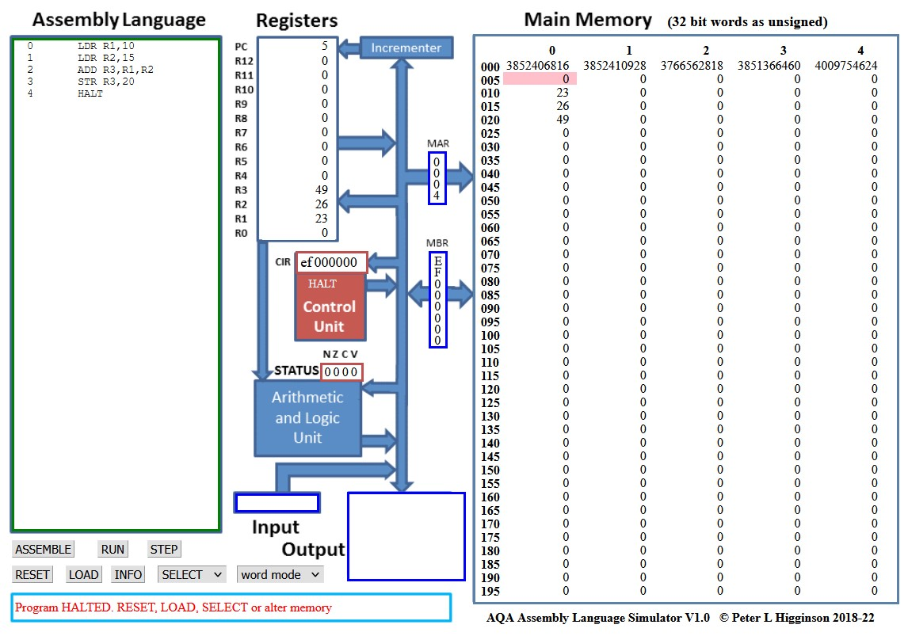

TP : Langage machine
======================

Les instructions d'un programme sont placées dans la mémoire puis exécutées par le processeur de la machine. Le processeur d'un ordinateur ne lit que des instructions en binaire ou en langage machine. 

Lorsqu'on écrit un programme avec un langage comme Python ou le C, il est nécessaire de transfomer ce programme en langage machine pour être lu et exécuté par le processeur. Il existe différentes solutions :

#.  La **compilation** est un programme qui transforme un programme écrit dans un langage en un programme écrit en binaire.
#.  Certains langages interprètent les instructions d'un programme en binaire. Cela veut dire que chaque instruction du programme est transformée en binaire puis exécutée par le processeur. C'est le cas de Python avec son **interpréteur**.
#.  Il existe une troisième solution qui consiste à écrire le programme directement en binaire. Enfin presque, car on utilise un langage qui peut être compris par le processeur : c'est l'assembleur ou langage machine.

Il existe sur le web un simulateur d'un processeur qui permet d'écrire des instructions en assembleur ou
langage machine. Vous le trouverez à l’adresse : https://www.peterhigginson.co.uk/AQA/

On donne ci-dessous les **principales instructions** du langage assembleur:

.. note::

    #.  Dans une opération mathématique, on a l'opérateur ``+``, ``-``, ``*`` et ``/`` et les valeurs qui sont appelées les ``opérandes``.
    #.  Un processeur dispose de ces propres espaces de mémoire appelés ``registre``.

L'opérande est une valeur désignée par ``#n`` ou ``Rm`` pour utiliser le contenu du registre ``Rm``.

-   ``LDR Rd, <mem ref>`` : Charge la valeur stockée dans l'emplacement mémoire spécifié par ``<mem ref>`` dans le registre ``d``.

-   ``STR Rd, <mem ref>`` : Stocke la valeur du registre ``d`` dans l'emplacement mémoire spécifié par ``<mem ref>``.

-   ``ADD Rd, Rn, <opérande>`` : Ajoute la valeur spécifiée par ``<opérande>`` à la valeur dans le registre ``n`` et stocke le résultat dans le registre ``d``.

-   ``SUB Rd, Rn, <opérande>`` : Soustrait la valeur spécifiée par ``<opérande>`` de la valeur dans le registre ``n`` et stocke le résultat dans le registre ``d``.

-   ``MOV Rd, <opérande>`` : Copie la valeur spécifiée par ``<opérande>`` dans le registre ``d``.

-   ``CMP Rn, <opérande>`` : Compare la valeur stockée dans le registre ``n`` avec la valeur spécifiée par ``<opérande>``.

-   ``B <label>`` : Branche toujours sur l’instruction à la position ``<label>`` dans le programme.

-   ``B <condition> <label>`` : Branche conditionnellement à l’instruction à la position ``<label>`` dans le programme si la dernière comparaison répond aux critères spécifiés par la ``<condition>``. Les valeurs possibles pour ``<condition>`` et leur signification sont : ``EQ`` pour Égal à, ``NE`` pour Non égal à, ``GT`` pour Supérieur à et ``LT`` pour Inférieur à.

-   ``AND Rd, Rn, <opérande>`` : Effectue une opération ``ET`` logique au niveau du bit entre la valeur dans le registre ``n`` et la valeur spécifiée par ``<opérande>`` et stocke le résultat dans le registre ``d``.

-   ``ORR Rd, Rn, <opérande>`` : Effectue une opération OU logique au niveau du bit entre la valeur dans le registre n et la valeur spécifiée par ``<opérande>`` et stocke le résultat dans le registre ``d``.

-   ``EOR Rd, Rn, <opérande>`` : Effectue une opération logique binaire ou exclusif ``XOR`` entre la valeur dans le registre ``n`` et la valeur spécifiée par ``<opérande>`` et stocke le résultat dans le registre ``d``.

-   ``MVN Rd, <opérande>`` : Effectue une opération ``NON`` logique au niveau du bit sur la valeur spécifiée par ``<opérande>`` et stocke le résultat dans le registre d.

-   ``LSL Rd, Rn, <opérande>`` : Décale logiquement à gauche la valeur stockée dans le registre ``n`` du nombre de bits spécifié par ``<opérande>`` et stocke le résultat dans le registre ``d``.

-   ``LSR Rd, Rn, <opérande>`` : Décale logiquement à droite la valeur stockée dans le registre ``n`` du nombre de bits spécifié par ``<opérande>`` et stocke le résultat dans le registre ``d``.

-   ``HALT`` : Arrête l'exécution du programme.

#.  Décrire par des phrases ce que font les différentes instructions suivantes écrites en langage assembleur.

    #.  .. code::
        
            ADD R0, R1, #25

    #.  .. code:: 
        
            LDR R2,64

    #.  .. code::
        
            MOV R3, #45

    #.  .. code::
        
            STR R4, 72

    #.  .. code::
        
            SUB R5,R2,R3

    #.  .. code::
        
            CMP R3, #25
            BGT 15

#.  Sur la capture de la première page, un programme en langage assembleur est donné. Que réalise ce programme ?

#.  Écrire en langage assembleur chacune des instructions données ci-dessous:

    .. code::

        Charge 15 dans le registre R0
        Charge 7 dans le registre R1
        Additionne R0 et R1; le résultat est stocké dans le registre R5
        Charge R5 en adresse mémoire 125.
        Charge 10 dans le registre R1
        Charge adresse mémoire 125 dans le registre R0
        Soustrait R0 et R1; le résultat est stocké dans le registre R5
        Déplace R5 en adresse mémoire 125.

#.  Quelles sont les valeurs dans les différents registres à l'issu de ce programme ?
#.  Saisir votre programme dans le simulateur et vérifier vos réponses.
