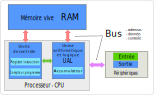
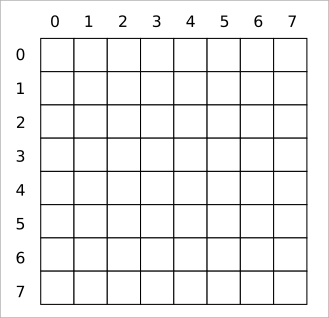
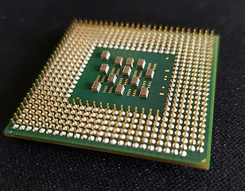

Modèle Von Neumann
===========================

.. figure:: ../img/JohnVonNeumann.jpg
    :width: 130
    :align: right

    John Von Neumann

L'ordinateur est une machine pensée par le mathématicien et physicien américano-hongrois John Von Neumann. Le principe, consiste à insérer un programme et les données du programme dans une mémoire et l'exécuter par l'ordinateur sans intervention humaine. 

L'architecture de l'ordinateur se compose de :

- La mémoire centrale
- L’unité centrale ou processeur (CPU)
- Les bus de communication entre la mémoire et le processeur
- Les unités d’entrée et sortie que sont les différents périphériques (disque dur, clavier, ...)

Le schéma ci-dessous en donne une représentation:

.. note::

    Un ordinateur manipule de l'information codée en **binaire**, c'est à dire des **bits** qui valent 0 ou 1. Ces bits sont regroupés par 8 et forment un **octet**. 

    Les capacités d'un ordinateur sont exprimées par des multiples d'octets : kilo-octet (Ko), mega-octet (Mo), giga-octet (Go) et tera-octet (To).

Mémoire vive d'un ordinateur
--------------------------------

La mémoire centrale appelée RAM (Random Access Memory) contient les programmes à exécuter et les données des programmes en binaire. 

Elle peut se représenter comme un tableau de cellules mémoires appelées **mots** mémoires.

-   La taille des cellules ou mots mémoires peut être de 32 ou 64 **bits**.
-   Chaque cellule est repérée par une **adresse mémoire** unique, association d'un identifiant de colonne et d'un identifiant de ligne.
-   L'accès au contenu du mot mémoire est en **lecture** et / ou en **écriture**.

.. warning::

    #. La mémoire centrale est volatile, ce qui signifie que toutes les données sont effacées lorsqu'il n'y a plus de tension électrique.
    #. La mémoire centrale ne doit pas être confondue avec d'autres mémoires, comme les mémoires persistantes dites mémoires de masse.

L'unité centrale ou processeur (CPU)
-------------------------------------

Le processeur d'un ordinateur est le cerveau de la machine, constitué de millions de composants électroniques rassemblés sur une puce de très petite taille. 

On distingue deux unités dans le processeur : l'**unité arithmétique et logique** et l'**unité de contrôle**.

.. rubric:: L'unité arithmétique et logique (UAL)

L'unité arithmétique et logique (UAL) effectue les opérations mathématiques et les opérations logiques. Il contient un **accumulateur** qui stocke les résultats des calculs.

.. rubric:: L'unité de contrôle

L’unité de contrôle joue le rôle du chef d'orchestre. Il charge les instructions du programme et les données contenues en mémoire vive dans les **registres** du processeur puis les envoie à l'UAL pour le traitement. Il contient un **compteur de programme** qui est incrémenté de 1 à chaque nouvelle instruction du programme exécuté.

.. rubric:: L'horloge

Le processeur contient une **horloge** qui rythme l'exécution des instructions d'un programme et des échanges entre le processeur et la mémoire vive. La fréquence du processeur, exprimée en giga hertz (GHz), indique le nombre d'instructions que le processeur peut réaliser en 1 seconde.  

Les bus de communication
------------------------

Le processeur et la mémoire vive communiquent par l'intermédiaire de **bus**. On distingue trois types de **bus**:

- le **bus d'adresse** qui permet au processseur d'accéder à l'emplacement de la mémoire.
- le **bus de données** qui permet au processeur et à la mémoire d'échanger les données.
- le **bus de contrôle** qui indique l'action à réaliser: lire ou écrire en mémoire.

.. note::
    
    Dans le processeur même, il y a des bus entre l'unité de contrôle et l'unité arithmétique et logique. La recherche et le développement de processeur tente de réduire au maximum ces bus d'échanges qui augmentent les temps d'exécution d'un programme.

Les unités d'entrée-sortie E/S
-------------------------------

La dernière partie de l'architecture de Von Neumann concerne les entrées et sorties appelées périphériques. Il existe de nombreux périphériques d'entrée et de sortie :

1.  Les périphériques d\'**entrée** :

    -   Les périphériques de saisies comme le clavier et la souris;
    -   Les manettes de jeu, les lecteurs de code (code barre, qrcode, etc.)
    -   Les scanners, les appreils photos, les webcams, etc.

2.  Les périphériques de **sortie** :

    -   les écrans et vidéo-projecteurs,
    -   les imprimantes,
    -   les hauts parleurs, etc.

3.  Les périphériques d\'**entrée et de sortie**:

    -   les lecteurs de disques (CD, Blue Ray, etc.)
    -   les disques durs, les clés USB ou les cartes SD,
    -   les cartes réseaux, wifi, etc.